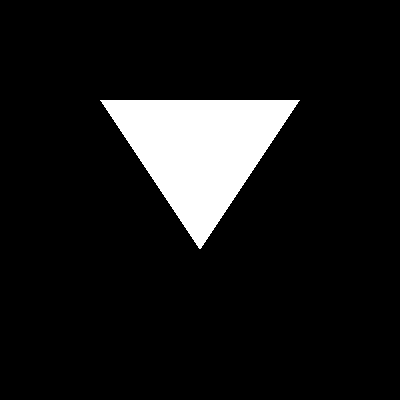

# SSAA

观察上一节我们渲染出来的三角形的斜边，放大后法线其锯齿很严重，这种现象在计算机图形学中叫做 **走样 (Aliasing)**，其原因是因为 **采样** 不足导致的。所以为了解决这个问题的最简单支持粗暴的方式就是增加采样率，也就是提高分辨率。但是我们希望不改变图形的分辨率的情况下消除这种锯齿，所以我们需要一种抗锯齿的算法。

这里介绍一种简单的抗锯齿算法 **SSAA(Super Sampling Anti-Aliasing，超采样抗锯齿)**。

**SSAA 的核心逻辑：**它将每个原始像素点细分为多个**子像素 (Sub-pixels)** 进行采样。在着色阶段，算法会统计落在三角形内部的子像素数量，计算其占总采样点的比例（覆盖率），最后将这些子像素的颜色信息进行**加权平均**，作为该原始像素的最终颜色。

详细来说就是

- 细分：将原始像素氛围多个子像素：2x2或者 4x4.
- 采样：判断子像素是否在三角形内
- 混合：如果一个像素里的 n 个子像素只有 s 个在三角形内，那这个原始像素的颜色就是原始颜色的s/n

思想非常的简单。所以我们可以对上届课的代码上更改。

据此我们可以实现如下代码

```c++
void draw_triangle_with_ssaa(lcg::PPM &ppm, lcg::Vec2 A, lcg::Vec2 B, lcg::Vec2 C, const int ssaa_factor = 4)
{
    AABB box = computeAABB(A, B, C);

    lcg::Vec2 AB = B - A;
    lcg::Vec2 BC = C - B;
    lcg::Vec2 CA = A - C;
    for (int y = (int)box.min.y; y <= (int)box.max.y; ++y)
    {
        for (int x = (int)box.min.x; x <= (int)box.max.x; ++x)
        {
            int inside_count = 0;
            for (int i = 0; i < ssaa_factor; i++)
            {
                for (int j = 0; j < ssaa_factor; j++)
                {
                    float sx = (float)x + (i + 0.5f) / ssaa_factor;
                    float sy = (float)y + (j + 0.5f) / ssaa_factor;
                    lcg::Vec2 P(sx, sy);

                    lcg::Vec2 AP = P - A;
                    lcg::Vec2 BP = P - B;
                    lcg::Vec2 CP = P - C;

                    float cross1 = AB.cross(AP);
                    float cross2 = BC.cross(BP);
                    float cross3 = CA.cross(CP);

                    if ((cross1 >= 0 && cross2 >= 0 && cross3 >= 0) ||
                        (cross1 <= 0 && cross2 <= 0 && cross3 <= 0))
                    {
                        inside_count++;
                    }
                }
            }
            if (inside_count > 0)
            {
                float coverage = (float)inside_count / (ssaa_factor * ssaa_factor);

                uint8_t color = (uint8_t)(255.0f * coverage);
                ppm.setPixel(x, y, color, color, color);
            }
        }
    }
}
```

开启SSAA（右边）与原始（左边）渲染对比

<table border="0">
    <tbody style="border: none;">
        <!-- Row 1 -->
        <tr style="border: none;">
            <td style="border: none;"></td>
                        <td style="border: none;"></td>
        </tr>
    </tbody>
</table>


可以看到锯齿明显消失